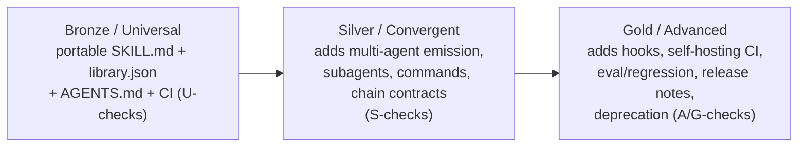

# Explanation: conformance and tiers

> **Three depths below.** Stop at whichever one answers your question.

---

## GLANCE (60 seconds)

The toolkit grades a plugin against the Advanced Skill Library Standard.

Checks emit `error` or `warn` findings keyed to requirement ids. `U5`, for example, is the description-quality rule.

The tiers are Universal / Convergent / Advanced, or Bronze / Silver / Gold.

**The tiers are cumulative: each includes the last.** That is why a Bronze plugin can grow into Silver and Gold without rework - the bar rises, the earlier work still counts.

The grade is capped at the tier a plugin declares in `library.json`, so it cannot over-claim.

---

## FULL (5 minutes)

### How a grade is produced

`evaluate` composes those checks into a report. `tier-report` rolls them into the highest tier a plugin satisfies, capped at the tier it declares in `library.json` so it cannot over-claim.

Each tier is cumulative: Silver includes every Universal check, Gold includes every Silver check. `tier-report` reports the highest tier a plugin fully satisfies and lists what blocks the next.

### Where the judgment stops

A description scoring below 0.7 is a warning, never an error. Quality is judgment, so the heuristic guides rather than gates.

### The toolkit grades itself

The toolkit is itself built to this Standard and validates itself in CI. It declares `tier: advanced` and satisfies Gold (G1-G10, on top of Bronze + Silver), so `npx agent-skills-toolkit tier-report --json` reports `tier: advanced` with an empty `blocked`. That makes it a self-proving example of the Standard.

See [`STANDARD.md`](../../STANDARD.md) for the normative rules.

### Visible burndown - reading `blocked.convergent` as the climb to Silver

`tier-report` caps `satisfies` at the plugin's declared tier, so a Bronze plugin cannot accidentally claim Silver. It lists everything above the ceiling as `blocked.<next-tier>`.

The gate-runner (`check.mjs`) follows the same model. Only errors at-or-below the declared tier fail the gate.

So a Bronze plugin that adds Silver requirements gradually sees its `blocked.convergent` list shrink, while CI stays green throughout the climb.

The repository completed the full climb to Gold. The toolkit now declares `tier: advanced` and `blocked` is empty, with Bronze, Silver, and Gold all satisfied.

---

## EXPERT (reference detail)

### Silver checks

Convergent (Silver) reqIds carry the `S` prefix. The current set:

| reqId | What | Standard | Conditional? |
|---|---|---|---|
| S1 | `library.json` `agent-targets` present + valid | sec 5.1, sec 2.2 | no |
| S2 | `library.json` `prefix` present + kebab-dash | sec 8.2 | no |
| S3 | `library.json` `components` index matches disk | sec 5.1, sec 10.3 | no |
| S4 | Chain-contract integrity (phantom; missing-when-chaining) | sec 3.6 | yes |
| S5 | Workflow skill-existence | sec 3.4 | yes |
| S6 | Per-target native-manifest presence | sec 5.1, sec 10.1 | yes |
| S7 | Command-contract (maps-to resolves to one skill/workflow; description present) | sec 3.2 | yes |
| S8 | Components index mirrors what is on disk, in both directions (no orphan or phantom entries) | sec 5.1 | no |

### Where S6 and S3 stand in this repository

S6 (per-target native-manifest presence) fires only when `agent-targets` is declared. It checks that each declared target has its generated native manifest on disk.

The repository declares `agent-targets: ["claude", "codex"]` and emits both manifests.

The `components` index (S3) is now present in `library.json`, so the Silver burndown is empty. The toolkit has since closed the Gold checks (G1-G10) too and declares `tier: advanced`.

### The Universal set and how it got here

One Universal check was added in the v0.2 hardening: **U9** (`version-match`). The `package.json` version must equal the `library.json` version, the source of truth.

A `U10` no-dashes check shipped at the same time. It was retired in Standard v0.11 as a stylistic house preference rather than a portability requirement, and now lives only as an opt-in author-time hook.

A later Universal check, **U13** (`skill-registration`), was added in Standard v0.12 (ADR 0035): a plugin whose manifest enumerates skills must register every skill it ships on disk. A skill on disk but unregistered ships invisibly to installers.

The full Universal set (`U1-U9`, `U11-U18`) is documented in [`../reference/universal-checks.md`](../reference/universal-checks.md).

---

## Related

- [`../reference/universal-checks.md`](../reference/universal-checks.md) - the Universal floor.
- [`../reference/silver-checks.md`](../reference/silver-checks.md) - the Silver checks, S1-S8.
- [`../reference/gold-checks.md`](../reference/gold-checks.md) - the Gold checks, G1-G10.
- [`STANDARD.md`](../../STANDARD.md) - the normative rules.
